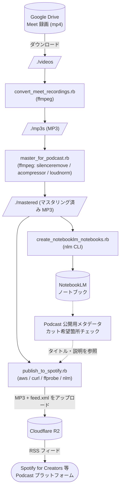

# podcast-publishing-toolkit

Google Meet の録画を Podcast として配信するためのパイプラインを構成する Ruby スクリプト集です。録画動画の MP3 変換、Podcast 公開向けのマスタリング、NotebookLM へのノートブック作成とエピソードメタデータ生成、Cloudflare R2 にホスティングした RSS フィード経由での Spotify for Creators 等への配信までを一通りカバーします。

## 構成図



## スクリプト

### `convert_meet_recordings.rb`

ディレクトリ内の動画ファイルを `ffmpeg` で MP3 に一括変換します。

- ファイル名に `Chat` を含むもの（Meet のチャットログ）はスキップします。
- 変換先に既に同名の MP3 が存在する場合はスキップします。

```sh
ruby convert_meet_recordings.rb <SOURCE_DIR> <DEST_DIR>
```

`ffmpeg` が `PATH` に通っている必要があります。

### `master_for_podcast.rb`

Audacity で行っていた Podcast 公開向けのマスタリング処理を `ffmpeg` のフィルタで再現し、ディレクトリ内の音声ファイルを一括処理します。

適用する処理は次の 3 つで、Audacity の現設定値に合わせています。

- Truncate Silence: しきい値 `-35dB`、1 秒以上の無音を `0.5` 秒に短縮 (`silenceremove`)
  - Audacity と `silenceremove` は実装差があり、同じ `-25dB` だと子音や息継ぎが誤判定されやすかったため、ffmpeg 側では少し低い `-35dB` にしています。
- Compressor: threshold `-10dB`, ratio `10`, knee `5dB`, attack `30ms`, release `150ms`, makeup `0dB` (`acompressor`)
  - Audacity の Lookahead `1ms` は `acompressor` に対応するパラメータがないため省略しています。
- Loudness Normalization: `-23 LUFS` (EBU R128) を **2-pass** で精密適用 (`loudnorm`)

入力ファイルは `.mp3` `.wav` `.m4a` `.flac` `.aac` を対象とし、出力は 192kbps の MP3 として出力先ディレクトリに同名で保存します。出力先に同名ファイルが既に存在する場合はスキップします。

```sh
ruby master_for_podcast.rb <SOURCE_DIR> <DEST_DIR>
```

`ffmpeg` が `PATH` に通っている必要があります。

### `create_notebooklm_notebooks.rb`

ディレクトリ内の MP3 ごとに NotebookLM のノートブックを作成し、その MP3 をソースとして登録します。[`nlm`](https://github.com/tmc/nlm) CLI を利用します。

- ノートブックのタイトルは MP3 のベース名です。
- いずれかのノートブックに同じファイル名のオーディオソースが既に存在する MP3 はスキップします。
- 過去の失敗で残った空のノートブックがある場合は再利用し、ソースの追加のみリトライします。
- ソース追加に成功すると、Podcast 公開用のエピソードタイトルとエピソード説明を NotebookLM に生成させ、ノートブック内に「Podcast 公開用メタデータ」というノートとして保存します（標準出力にも表示します）。
- 続けて、録音内に「ここはカットしてほしい」など特定箇所の削除を依頼している発言がないかを NotebookLM にチェックさせ、結果を「カット希望箇所チェック」というノートとして保存します（標準出力にも表示します）。該当が無ければその旨が記録されます。

```sh
ruby create_notebooklm_notebooks.rb <MP3_DIRECTORY>
```

`nlm` が `PATH` に通っており、`nlm login` で認証済みである必要があります。

#### Backfill モード

`--backfill` を付けると、ノートブックの新規作成やソース追加は行わず、既に取り込み済みの MP3 を対象に「Podcast 公開用メタデータ」ノートと「カット希望箇所チェック」ノートのうち未作成のものだけを生成・保存します。古いノートブックへの後追い生成に利用します。

```sh
ruby create_notebooklm_notebooks.rb --backfill <MP3_DIRECTORY>
```

- MP3 ディレクトリは対象フィルタとして使用され、ソースが見つからない MP3 はスキップされます。
- 既にノートが存在するノートブックはスキップします（重複生成しません）。

### `publish_to_spotify.rb`

マスタリング済み MP3 と NotebookLM の「Podcast 公開用メタデータ」ノートをもとに、Cloudflare R2 にホスティングした RSS フィード（`feed.xml`）へエピソードを追加します。Spotify for Creators をはじめ RSS をインポートする Podcast プラットフォームに配信できます。

#### 前提

- `aws` CLI、`curl`、`ffprobe`、`nlm` が `PATH` に通っていること（`nlm login` で認証済み）
- `podcast.yml.example` を `podcast.yml` にコピーし、R2 アカウント情報・公開 URL・既存 RSS URL を記入
- `.env.example` を `.env` にコピーし、R2 のアクセスキー（`R2_ACCESS_KEY_ID` / `R2_SECRET_ACCESS_KEY`）を設定
- どちらのファイルも `.gitignore` 済み

#### 初回ブートストラップ（既存 RSS の取り込み）

```sh
ruby publish_to_spotify.rb --bootstrap
```

`podcast.yml` の `existing_rss_url` から RSS を取得し、そのまま `feed.xml` として R2 にアップロードします。完了時に表示される URL を Spotify for Creators の RSS フィード差し替え機能に登録してください（一度切りの手動作業）。過去エピソードの enclosure URL は旧ホスティングのまま残るため、再アップロードは不要です。

#### エピソード追加（通常運用）

```sh
ruby publish_to_spotify.rb ./mastered
```

挙動:

- R2 から最新の `feed.xml` をダウンロードし、既存 GUID（MP3 ファイル名）を読み取り
- ディレクトリ内の各 MP3 について、既に feed に含まれているものはスキップ
- NotebookLM の「Podcast 公開用メタデータ」ノートからタイトルと説明をパース（NotebookLM の引用記号 `[1]`, `[1-3]` 等は自動的に除去）
- MP3 を R2 にアップロード
- `feed.xml` に `<item>` を追加（最新エピソードが先頭になるよう既存 `<item>` の前に挿入）
- 全件処理後に `feed.xml` を R2 に再アップロード

予約公開（pubDate を未来日時にすると Spotify はその時刻まで配信を保留）は次のオプションで指定します。

```sh
ruby publish_to_spotify.rb ./mastered \
  --start-date 2026-05-15T07:00:00+09:00 \
  --interval-days 7
```

複数 MP3 を投入する場合、最初のエピソードが `--start-date` の日時、以降は `--interval-days` 日ずつずれて配信されます。`--start-date` / `--interval-days` を省略した場合は `podcast.yml` の `schedule.start_date` / `schedule.interval_days` を使用します。

`--dry-run` を付けるとアップロードや `feed.xml` 更新を行わず、追加予定のタイトル・公開日時・MP3 URL のみ表示します。

#### 公開前レビュー（タイトル・説明の修正フロー）

NotebookLM が生成したタイトルや説明を公開前に確認・修正したい場合は、`--no-publish` でステージしてから `--publish-feed` で公開する 2 段階に分けます。

```sh
# 1. ステージ: MP3 アップロードとローカル feed.xml への追記まで行い、公開はしない
ruby publish_to_spotify.rb ./mastered --no-publish

# 2. レビュー: ローカルの feed.xml を開き、タイトル・説明を直接修正

# 3. 公開: ローカルの feed.xml をそのまま R2 にアップロード
ruby publish_to_spotify.rb --publish-feed
```

注意点:

- `--no-publish` のステージ時点で MP3 は R2 にアップロードされます（公開 URL は `feed.xml` が公開されるまで参照されないため実害はありませんが、エピソードを取りやめた場合は R2 上に未参照の MP3 が残ります）。
- `--no-publish` は実行のたびに R2 から最新の `feed.xml` を再取得して上書きします。**ステージ後に手で修正したら、再度 `--no-publish` を実行せずに `--publish-feed` へ進んでください**（修正が失われます）。

## 典型的なワークフロー

1. Google Drive から Meet の録画（mp4）をダウンロード
2. `ruby convert_meet_recordings.rb ./videos ./mp3s`
3. `ruby master_for_podcast.rb ./mp3s ./mastered`
4. `ruby create_notebooklm_notebooks.rb ./mastered`
5. （初回のみ）`ruby publish_to_spotify.rb --bootstrap` → Spotify for Creators で RSS URL を差し替え
6. `ruby publish_to_spotify.rb ./mastered --start-date <YYYY-MM-DDTHH:MM:SS+09:00> --no-publish`（ステージ）
7. ローカルの `feed.xml` でタイトル・説明をレビュー・修正
8. `ruby publish_to_spotify.rb --publish-feed`（公開）
